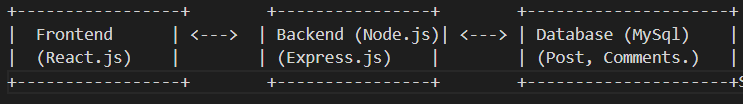

# UcuInside_frontend

## dependencias: 
-react-router-dom
-bootstrap
-axios
-auth0

## Instrucciones para la instalación y ejecución de la aplicación web:
### 1. Clonar el repositorio
git clone <https://github.com/Guss310/typeforfun_frontend.git>

cd typeforfun_frontend

### 2. Instalar dependencias
npm install

### 3. Ejecutar la aplicación
npm start

### 4. Si deseas compilar la aplicación para producción
npm run build

### 5. Ejecutar el servidor backend (opcional)
git clone <URL_DEL_REPOSITORIO>
cd <NOMBRE_DEL_REPOSITORIO>
npm install
npm start

## descripción de arquitectura

#### Visión General
El sistema es una plataforma estilo Reddit en línea donde los usuarios se pueden crear publicaciones, comentar en ellas y votarlas. Los usuarios pueden registrarse e iniciar sesión.

#### Componentes Principales
Frontend (Cliente - React.js):

La interfaz de usuario está construida usando React.js. Los usuarios interactúan con la aplicación a través de formularios de creación de publicaciones, botones de votación, y comentarios en las publicaciones.
El frontend se comunica con el backend a través de peticiones HTTP (usando Axios).

#### Backend (Servidor - Node.js/Express.js)

El backend es responsable de manejar la lógica de negocio, las solicitudes del cliente y la comunicación con la base de datos.
Se utiliza Express.js para crear rutas de la API REST que permiten al frontend interactuar con el sistema.

#### Base de Datos:

La base de datos MySQL se utiliza para almacenar documentos que representan a los usuarios, las publicaciones, los comentarios y los votos. Cada documento es flexible y puede contener diferentes campos sin necesidad de una estructura fija.
Para la gestión de usuarios y publicaciones, se utilizarán colecciones como posts, y comments.

#### Flujo de Trabajo

##### Creación de Publicación

1-El usuario se registra o inicia sesión en el frontend.

2-Cuando el usuario crea una publicación, se envía una solicitud POST al servidor de Node.js con los detalles de la publicación.

3-El backend almacena la publicación en MySql.

4-Después de guardar la publicación, el backend devuelve una respuesta con los detalles de la publicación recién creada, y el frontend actualiza la UI.

##### Creación de Comentario

1-El usuario se registra o inicia sesión en el frontend.

2-Cuando el usuario crea una publicación, se envía una solicitud POST al servidor de Node.js con los detalles del comentario y la ip del post asociado.

3-El backend almacena la publicación en MySql.

4-Después de guardar la publicación, el backend devuelve una respuesta con los detalles de la publicación recién creada, y el frontend actualiza la UI.

##### Voto de usuario

1-El usuario se registra o inicia sesión en el frontend.

2-Cuando el usuario crea una voto en una publicación o comentario, se envía una solicitud PUT al servidor de Node.js con los detalles del voto así este es modificado en la base de datos.

3-Después de cambiar el valor del voto, el backend devuelve una respuesta con los detalles de las publicaciónes o commentarios afectados, y el frontend actualiza la UI.

##### Tecnologías Utilizadas
Frontend: React.js, Axios.
Backend: Node.js, Express.js.
Base de Datos: MySql, XAMPP.

#### Diagrama

### Explicación de Decisiones técnicas.

#### FrontEnd
##### Tecnología elegida:

Elegí React.js como el framework principal para el frontend debido a su enfoque basado en componentes, que permite un desarrollo más modular y mantenible. Además, React tiene un gran ecosistema y es muy popular, lo que facilita la incorporación de nuevas funcionalidades.

##### Estilo y diseño: 
Elegí Bootstrap para el diseño de la interfaz debido a su conjunto de componentes predefinidos y su sistema de rejilla (grid system), lo que permite desarrollar interfaces responsivas de manera rápida y consistente. Además, la amplia documentación y la comunidad activa de Bootstrap facilitan la implementación de elementos como botones, formularios y modales sin tener que escribir CSS desde cero.

#### Decisiones Relacionadas con el Backend

##### Tecnología del backend:

Terminé eligiendoNode.js con Express.js debido a que ambos son altamente eficientes para desarrollar aplicaciones web escalables, especialmente cuando se trata de manejar solicitudes concurrentes, lo cual esta muy bueno para una aplicación de discusión en línea con muchos usuarios activos. Además, la compatibilidad con JavaScript en todo facilita el desarrollo.

##### Base de datos:

Elegí MySQL como base de datos relacional debido a su robustez y consistencia, lo que garantiza la integridad de los datos, especialmente en operaciones críticas como la creación de publicaciones, comentarios y votos. Además, MySQL es muy adecuado para consultas complejas y relaciones entre tablas, lo que facilita la gestión de datos estructurados y la escalabilidad en un entorno de alto rendimiento. Al ser ampliamente utilizado, MySQL también ofrece una gran comunidad y herramientas de optimización que contribuyen a un desarrollo más eficiente.

#### Decisiones Relacionadas con la Usabilidad y la Experiencia del Usuario (UX/UI):

##### Diseño y Usabilidad:

El diseño de la aplicación busca ser comoda tanto para ordenador, como para usuarios de otras plataformas. Cuenta con desplieges responsive ya que muchos usuarios accederan desde dispositivos moviles. 
Al Blog se accede a travez de una landing page que contiene información asociada a la universidad.